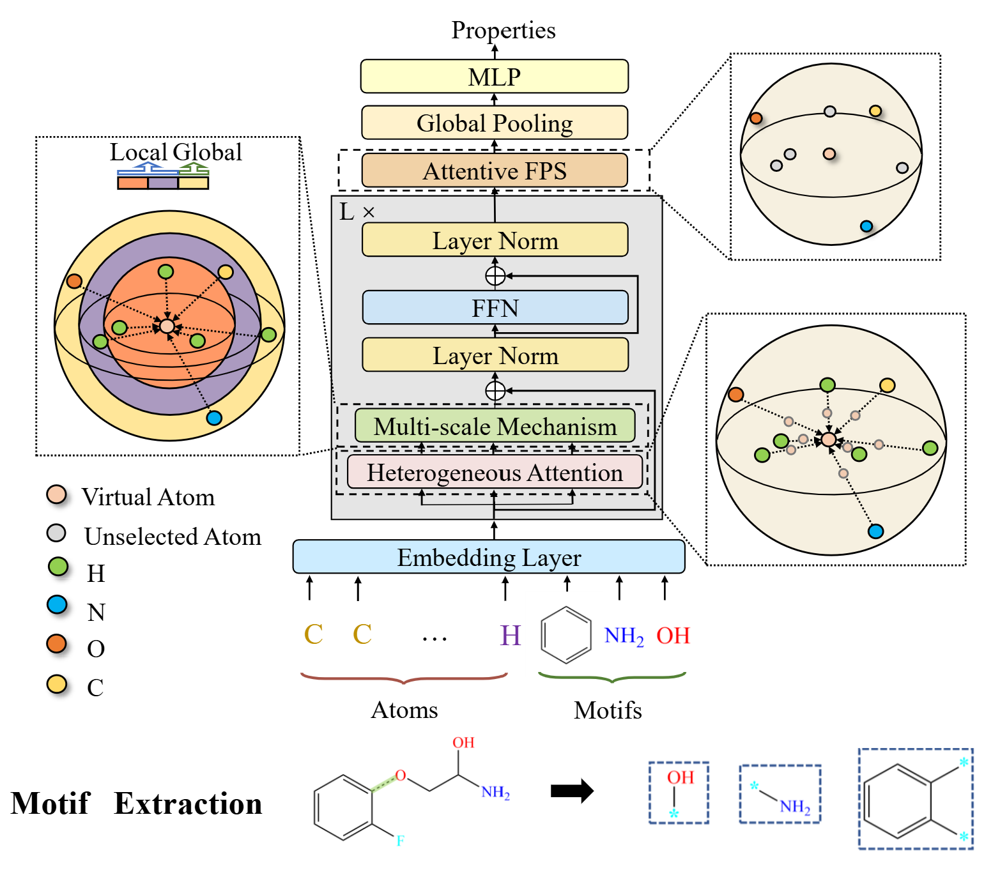

# Molformer 
## Introduction
This is the repository for our Molformer.



## Intsallation 
 ```bash
# Install packages
pip install pytorch scikit-learn mendeleev
pip install rdkit-pypi
```
 
 
## Dataset
We test our model in three different domains: quantum chemistry, physiology, and biophysics. We also provide information 
on datasets regarding the material science used in the preceding 3D-Transformer. You can download the 
raw datasets from the following links.  
### Quantum Chemistry
- **QM7 Dataset**  
Download (Official Website): <http://quantum-machine.org/datasets/>    
Download (DeepChem): <https://github.com/deepchem/deepchem/blob/master/deepchem/molnet/load_function/qm7_datasets.py#L30-L107>    
Discription (DeepChem): <https://deepchem.readthedocs.io/en/latest/api_reference/moleculenet.html#qm7-datasets>  

- **QM8 Dataset**  
Download (DeepChem): <https://github.com/deepchem/deepchem/blob/master/deepchem/molnet/load_function/qm8_datasets.py>     
Discription (DeepChem): <https://deepchem.readthedocs.io/en/latest/api_reference/moleculenet.html?highlight=qm7#qm8-datasets>   


- **QM9 Dataset** 
Download (Official Website): <https://ndownloader.figshare.com/files/3195389>    
Download (Deep Chem): <https://github.com/deepchem/deepchem/blob/master/deepchem/molnet/load_function/qm9_datasets.py>    
Download (Atom3D): <https://www.atom3d.ai/smp.html>       
Download (MPNN Supplement): <https://drive.google.com/file/d/0Bzn36Iqm8hZscHFJcVh5aC1mZFU/view?resourcekey=0-86oyPL3e3l2ZTiRpwtPDBg>     
Download (Schnet): <https://schnetpack.readthedocs.io/en/stable/tutorials/tutorial_02_qm9.html#Loading-the-data>  


- **GEOM-QM9 Dataset**   
Download (Official Website): <https://doi.org/10.7910/DVN/JNGTDF>     
Tutorial of usage: <https://github.com/learningmatter-mit/geom/blob/master/tutorials/01_loading_data.ipynb>                              
 

### Physiology
- **BBBP**  
Download and Description (from Moleculnet): <https://moleculenet.org/datasets-1>    
Download (from Glambard): <https://github.com/GLambard/Molecules_Dataset_Collection>     
Description (From Deepchem): <https://deepchem.readthedocs.io/en/latest/api_reference/moleculenet.html>  
Description (From DGL-sci): <https://lifesci.dgl.ai/api/data.html#tox21>   
 
- **ClinTox**  
Download and Description (from Moleculnet): <https://moleculenet.org/datasets-1>   
Download (from Glambard): <https://github.com/GLambard/Molecules_Dataset_Collection>   
Description (From Deepchem): <https://deepchem.readthedocs.io/en/latest/api_reference/moleculenet.html>      
Description (From DGL-sci): <https://lifesci.dgl.ai/api/data.html#tox21>   


### Biophysics  
- **PDBbind**    
Atom3d: <https://github.com/drorlab/atom3d>  <ol> <li> install atom3D `pip install atom3d`</li> <li> download 
'split-by-sequence-identity-30' dataset from <https://www.atom3d.ai/> </li>  <li> preprocess 
the data by running `python pdbbind/dataloader_pdb.py` </li> </ol>


- **BACE**    
Download and Description (from Moleculnet): <https://moleculenet.org/datasets-1>   
Download (from Glambard): <https://github.com/GLambard/Molecules_Dataset_Collection>    
Description (From Deepchem): <https://deepchem.readthedocs.io/en/latest/api_reference/moleculenet.html>    
Description (From DGL-sci): <https://lifesci.dgl.ai/api/data.html#tox21>   

### Material Science  
- **COREMOF**  
Download (Baidu Drive):  <https://pan.baidu.com/s/12N8gM8_TQ1mpBGx6gdkAog>  (password：`l41s`)  
Reproduction of PointNet++: `python coremof/reproduce/main_pn_coremof.py`  
Reproduction of MPNN: `python coremof/reproduce/main_mpnn_coremof.py`  
Repredoction of SchNet: <ol><li> load COREMOF `python coremof/reproduce/main_sch_coremof.py` </li> <li> 
run SchNet `spk_run.py train schnet custom ../../coremof.db ./coremof --split 900 100 --property LCD --features 16 --batch_size 20 --cuda`  
(Note: official script of Schnet cannot be reproduced successfully due to the memory limitation.)</li></ol>


## Models
`models/tr_spe`: 3D-Transformer with Sinusoidal Position Encoding (SPE)  
`models/tr_cpe`: 3D-Transformer with Convolutional Position Encoding (CPE)    
`models/tr_msa`: 3D-Transformer with Multi-scale Self-attention (MSA)    
`models/tr_afps`: 3D-Transformer with Attentive Farthest Point Sampling (AFPS)    
`models/tr_full`: 3D-Transformer with CPE + MSA + AFPS   

## Quick Tour
### Model Usage
After processing the dataset, it is time to establish the model. Suppose there are `N` types of atoms, and `n` 
downstream multi-tasks. If you only need to predict a single property, set `n = 1`. For multi-scale self-attention, 
a dist_bar is needed to define the different scales of local regions, such as `dist_bar=[1, 3, 5]`. You can also specify the number of 
attention heads, the number of encodes, the dimension size, the dropout rate, etc. There, we only adopt the defaults.
```python
>>> import torch 
>>> from model.tr_spe import build_model
 
# initialize the model 
>>> model = build_model(N, n).cuda()

# Take a 4-atom molecule for example
>>> x = torch.tensor([[1, 1, 6, 8]]).cuda()
>>> pos = torch.tensor([[[7.356203877, 9.058198382, 3.255188164],
                         [5.990730587, 3.951633382, 9.784664946],
                         [1.048332315, 3.912215133, 9.827313903],
                         [2.492201352, 9.097616820, 3.297837121]]]).cuda()
>>> mask = (x != 0).unsqueeze(1)
>>> out = model(x.long(), mask, pos)
```

```python
>>> import torch 
>>> from model.tr_msa import build_model
 
# Initialize the model 
>>> model = build_model(N, n, dist_bar).cuda()

# Take a 4-atom molecule for example
>>> x = torch.tensor([[1, 1, 6, 8]]).cuda()
>>> pos = torch.tensor([[[7.356203877, 9.058198382, 3.255188164],
                         [5.990730587, 3.951633382, 9.784664946],
                         [1.048332315, 3.912215133, 9.827313903],
                         [2.492201352, 9.097616820, 3.297837121]]]).cuda()
>>> mask = (x != 0).unsqueeze(1)
>>> dist = torch.cdist(pos, pos).float()
>>> out = model(x.long(), mask, dist)
```

### Motif Extraction
We rely on [RDKit](https://www.rdkit.org/docs/GettingStartedInPython.html) to extract motifs in small molecules. 
Given the SMILES representation of any molecule, we can manually define the substructures using Smarts. 
```python
>>> from rdkit import Chem
>>> mol = Chem.MolFromSmiles(smiles)
>>> pattern = Chem.MolFromSmarts('C(=O)')
>>> mol.HasSubstructMatch(pattern) # check whether the molecule has the motif 'C(=O)'
>>> mol.GetSubstructMatches(pattern) # get atoms that belong to the motif 'C(=O)'
```


## Citation
If you like our paper and find it helpful, please cite!
```
@inproceedings{wu2023molformer,
  title={Molformer: Motif-based transformer on 3d heterogeneous molecular graphs},
  author={Wu, Fang and Radev, Dragomir and Li, Stan Z},
  booktitle={Proceedings of the AAAI Conference on Artificial Intelligence},
  volume={37},
  number={4},
  pages={5312--5320},
  year={2023}
}
```

### Contact 
If you are interested in our work, please cite.   
Any questions and collaboration are welcome, please contact [Fang Wu](fangwu97@stanford.edu)
